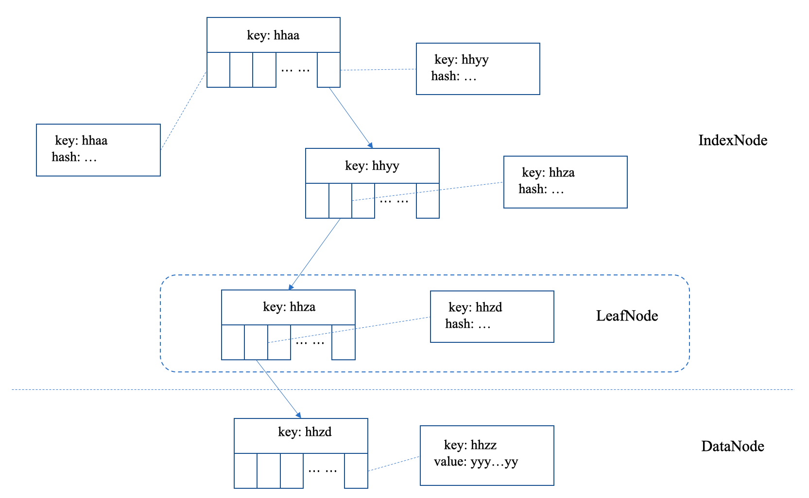

- [LiteSDK 数据证明文档](#litesdk-数据证明文档)
  - [第一章. 前言](#第一章-前言)
    - [1.1 版本对应关系](#11-版本对应关系)
    - [1.2 获取Service](#12-获取service)
  - [第二章.交易证明](#第二章交易证明)
  - [第三章.账户证明](#第三章账户证明)
  - [第四章.状态证明](#第四章状态证明)
    - [4.1 获取状态数据路径](#41-获取状态数据路径)
    - [4.2 验证状态数据](#42-验证状态数据)
    - [4.3 demo](#43-demo)

# LiteSDK 数据证明文档

## 第一章. 前言

本文档是LiteSDK的补充文档，提供hyperchain中数据证明（交易证明，账户证明，状态证明）的使用指南。

文档中通用数据结构参考`hyperchain_litesdk_document.md`文档中的介绍，不再赘述，本文档主要介绍对于数据证明的相关接口，其中交易证明和账户证明通过hyperchain接口直接提供，而状态证明需要由archiveReader来提供。

### 1.1 版本对应关系

|  接口  | 平台版本 | archiveReader版本 | LiteSDK版本 |
| ----  | ----  | ---- | ---- |
| 交易证明 | 2.5.0+ | - | 1.3.0+ |
| 账户证明 | 2.5.0+ | - | 1.3.0+ |
| 状态证明 | - | 单元格 | 1.3.0+ |

### 1.2 获取Service

数据证明相关接口由`ProofService`服务来提供，获取服务方式同其他`Service`一致，通过`ServiceManager`来获取

```java
ProofService proofService = ServiceManager.getProofService(providerManager);
```

## 第二章.交易证明

### 2.1 获取交易证明路径

参数：
* txHash 交易hash
* nodeIds 请求向哪些节点发送

```java
Request<TxProofResponse> getTxProof(String txHash, int... nodeIds);
```

查询获得的数据结构TxProofResponse通过getResult方法可获取到交易在对应的区块下生成的证明路径TxProof：

```java
public class TxProof {
    private List<MerkleProofNode> proofPath;
}

public class MerkleProofNode {
        private String hash;
        private int index;
}
```
返回的TxProof是MerkleProofNode的列表，每个MerkleProofNode中有节点的Hash值以及在父节点的索引index。

### 2.2 验证交易证明
该验证函数由ProofValidation类提供

参数：
* txProof 查询获得的交易证明
* txHash 查询交易证明时传入的交易hash
* txRoot 交易所在的区块的TxRoot

```java
Boolean validateTxProof(TxProof txProof, String txHash, String txRoot);
```
validateTxProof将返回一个布尔值，说明证明验证是否成功，若成功则说明需要验证的交易存在于对应区块上。

## 第三章.账户证明

### 3.1 获取账户证明路径

参数：
* addr 账户地址
* blockNumber 区块号
* nodeIds 请求向哪些节点发送

```java
Request<AccountProofResponse> getAccountProof(String addr, BigInteger blockNumber, int... nodeIds);
```

查询获得的数据结构AccountProofResponse通过getResult方法可获取到账户在对应的区块账本下生成的证明路径AccountProof：

```java
public class AccountProof {
    private List<ProofNode> accountPath;
}
```
返回的accountPath是ProofNode的列表，ProofNode的详细解释可见4.1

### 3.2 验证账户证明
该验证函数由ProofValidation类提供

参数：
* addr 账户地址
* accountProof 查询获得的账户证明

```java
Boolean validateAccountProof(String addr, AccountProof accountProof);
```
validateAccountProof将返回一个布尔值，说明证明验证是否成功，若成功则说明需要验证的账户存在于对应的区块账本上。


## 第四章.状态证明

### 4.1 获取状态数据路径

参数：
* proofParam 状态查询参数
* nodeIds 请求向哪些节点发送

```java
Request<StateProofResponse> getStateProof(ProofParam proofParam, int... nodeIds);
```

ProofParam数据结构（均可通过对应构造函数创建）：

```java
public class ProofParam {
    private LedgerMetaParam meta;
    private KeyParam key;
}

public class LedgerMetaParam {
    private String snapshotID;
    private long seqNo;
}

public class KeyParam {
    private String address;
    private String fieldName;
    private List<String> params;
    private String vmType = "HVM";
}
```

参数介绍和作用

LedgerMetaParam参数是用来指定证明操作基于哪个账本来执行：

* snapshotID：用于指定archiveReader上的数据目录；
* seqNo：在当前的路径下，具体要基于哪个区块的状态获取（验证）证明数据；

KeyParam参数是指在合约中操作账本数据时所使用的逻辑条件，以此来生成用户想要验证的状态数据：

* address：合约地址
* fieldName：合约中需要验证的数据结构的变量名
* params：通过哪些参数可在对应的合约变量下获取到状态数据，以字符串形式传入
* vmType：合约虚拟机类型，目前仅支持HVM

以HVM为例，需要查询的数据结构变量应为被表述了@StoreField的属性：

```java
@StoreField
private Person p1; // -> fieldName:p1, params无

@StoreFiled
private HyperMap<String, String> map1;
map1.put("key1", "value1"); // -> fieldName:map1, params：key1

@StoreField
private HyperList<String> list1;
list1.add("value1"); // -> fieldName:list1, params：0(list的索引)

@StoreField
private HyperTable table1;
table1.put("col", "cf", "col", "value1"); // -> fieldName:table1, params:[col,cf,col]

@StoreFiled
private NestedMap<String, String> nestedMap1;
nestedMap1.put("key1", "value1"); // -> fieldName:nestedMap1, params：key1, 若为多层嵌套则需要传入多个key组成的数组，直至最后一层NestedMap
```

查询获得的数据结构StateProofResponse通过getResult方法可获取到状态数据在区块链账本中的路径结构StateProof：

```java
public class StateProof {
    private List<ProofNode> statePath;
    private List<ProofNode> accountPath;
}

public class ProofNode {
        private boolean isData;
        private String key;
        private String hash;
        private List<Inode> inodes;
        private int index;
}
```

StateProof中包含两个字段（statePath与accountPath）。其中statePath表示从statedb中获取的证明数据；accountPath表示的是从accountdb中获取的证明数据。

每一个db中的具体证明数据是一个ProofNode的列表，这个列表反映了完整的证明路径。在vidb中，数据是以Merkle-B+树的形式组织的，而证明路径则包含了每一层中访问这个key所经过的节点。证明数据的形象表示形式为：



最后，对ProofNode各个字段做一个说明

```json
{
	// bool值，是否为数据节点
	"isData": false,
	// byte数组，base64编码，表示当前节点的最小的key
	"key": "AAAAAAAAAAAAAAAAAAAAAAD//wI=",
	// 节点的哈希值，base64编码，表示当前节点所有数据的hash
	"hash": "qi/Wc2VvS62m/22FiEmCOe6zICIUokAF1s8BOKnzCnk=",
	// 数组结构，每一个元素都是一个json结构：{key是base64编码的byte数组，hash是base64编码的byte数组}
	"inodes": [{
		"key": "AAAAAAAAAAAAAAAAAAAAAAD//wI=",
		"hash": "JO9J8Ol/DmWYFjFBMS28Ob3eFhliJ4k6TY/zAlIavJM="
	}],
	// index表示的是在向下层寻找key的过程中，当前节点使用的是哪个位置的分支继续向下寻找的
	"index": 0
}
```

### 4.2 验证状态数据

参数：
* proofParam 状态状态数据路径参数
* stateProof 查询获得的状态数据路径结构
* merkleRoot 验证路径区块对应的账本hash，即LedgerMetaParam的seqNo所对应的区块的merkleRoot
* nodeIds 请求向哪些节点发送

```java
Request<ValidateStateResponse> validateStateProof(ProofParam proofParam, StateProof stateProof, String merkleRoot, int... nodeIds);
```

参数merkleRoot可通过查询区块信息获取得到，需与proofParam中的seqNo对应，stateProof也需为由proofParam查询而来。

ValidateStateResponse通过getResult将返回一个布尔值，说明路径验证是否成功，若成功则说明需要验证的账本key数据存在于账本上。

### 4.3 demo

```java
BlockResponse.Block block = blockService.getLatestBlock().send().getResult().get(0);
String bn = block.getNumber();
String filterID = archiveService.snapshot(BigInteger.valueOf(Long.parseLong(bn.substring(2), 16))).send().getResult();
System.out.println(filterID);

ProofParam proofParam = ProofParam.createProofParam(filterID, 2, "0x6de31be7a30204189d70bd202340c6d9b395523e", "hyperMap1", Arrays.asList("key1"));
StateProofResponse stateProofResponse = proofService.getStateProof(proofParam).send();
System.out.println(stateProofResponse.getResult());

ValidateStateResponse validateStateResponse = proofService.validateStateProof(proofParam, stateProofResponse.getResult(), "0xaa2fd673656f4bada6ff6d8588498239eeb3202214a24005d6cf0138a9f30a79").send();
System.out.println(validateStateResponse.getResult());
```
